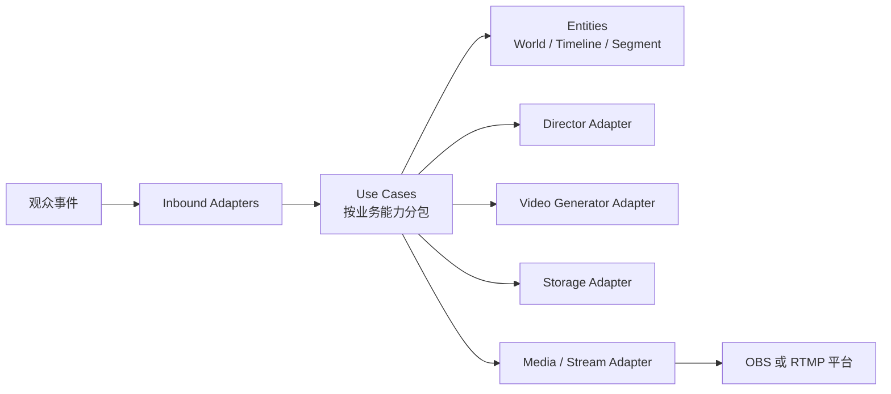

# 架构与代码边界

[返回索引](README.md) · 下一篇：[核心模型](02-domain-model.md)

## 系统形状



它是一个模块化单体，不是把多个服务塞进一个进程。模块通过明确类型和用例协作，外部入口不能绕过用例直接改核心状态。

## Clean Architecture 规则

Clean Architecture 定义的是 Entities、Use Cases、Interface Adapters、Frameworks/Drivers 的依赖圈，不是 Go 的目录模板。这里不用 `application/domain` 分层；按业务能力命名 Go 包，同时保持依赖向内：

```text
cmd / adapter / platform
            |
            v
session / timeline / director / generation / streaming / audience
            |
            v
           live
```

- `live`：Entities 与最稳定的不变量，只依赖 Go 标准库。
- 业务能力包：承载 Use Case，并在使用处定义所需端口。
- `adapter`：Interface Adapters，把 HTTP、供应商 API、SQL、文件和进程转换为用例语义。
- `platform`：配置、日志、指标、HTTP server 等通用运行设施，不含直播决策。
- `cmd/live`：Framework/Driver 一侧的 Composition Root，读取配置并组装具体实现。

端口不是单独的一层，也不集中放进 `ports` 包。`generation.Generator` 由 generation 用例使用方定义，fal Adapter 实现它；`live` 不知道这些端口存在。

## 建议目录

目录只在对应阶段出现；不创建空壳包。

```text
.
├── cmd/
│   └── live/
│       └── main.go              # 组装并启动
├── internal/
│   ├── live/                    # Entities 与核心不变量
│   │   ├── session.go
│   │   ├── timeline.go
│   │   ├── segment.go
│   │   ├── world.go
│   │   └── direction.go
│   ├── session/                 # 会话用例与其 Store 接口
│   ├── timeline/                # 计划、commit 与 playhead 用例
│   ├── director/                # Direction 用例与 Director 接口
│   ├── generation/              # Scheduler 与 Generator 接口
│   ├── streaming/               # 播放用例与 Output 接口
│   ├── audience/                # 事件接收与聚合用例
│   ├── adapter/
│   │   ├── in/
│   │   │   ├── http/
│   │   │   └── bilibili/
│   │   └── out/
│   │       ├── director/
│   │       ├── generator/fal/
│   │       ├── stream/ffmpeg/
│   │       ├── storage/postgres/
│   │       └── asset/local/
│   └── platform/
│       ├── config/
│       └── observability/
├── docs/
└── web/                         # 需要控制台时再创建
```

## 包的职责

| 包 | 可以知道 | 不可以知道 |
|---|---|---|
| `live` | 直播世界、Segment/Timeline 不变量 | 端口、HTTP、SQL、模型名、FFmpeg |
| 业务能力包 | 对应能力的用例、消费方接口、事务边界 | 供应商 DTO、命令行参数 |
| `adapter/in` | 输入协议、DTO、鉴权 | 业务状态转换细节 |
| `adapter/out` | 外部协议和错误映射 | 决定何时重试、何时降级 |
| `platform` | 配置、进程、遥测 | “缓冲少于 15 秒”等业务规则 |
| `cmd/live` | 具体实现和启动顺序 | 可复用业务逻辑 |

## 模块通信

- 外部输入被转换成 Command 或 Event，再调用一个业务用例。
- 用例通过 `live` 类型的方法改变状态，不绕过不变量直接修改字段。
- 用例通过自己拥有的小接口访问外部系统。
- 事务只包围一次清晰的状态转换，不跨越长时间生成任务。
- 异步工作保存显式状态，由 webhook 或 reconciliation 用例推进。

## 保持 Go 风格

- 接口放在使用方附近，通常只有 1～3 个方法。
- 不为纯函数、配置结构或只有一个无需替换的实现创建接口。
- 使用具体类型构造，按需返回接口；避免 `manager`、`helper`、`utils`、`common` 包。
- 错误只在能增加业务上下文时包装；只在能处理时记录。
- 优先小包和显式调用，不引入容器、反射式依赖注入或内部事件框架。
