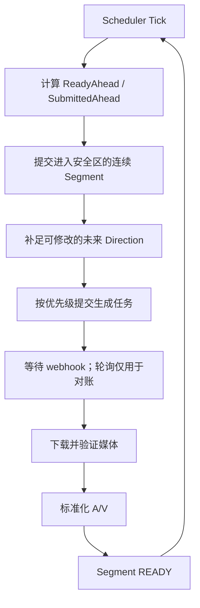

# 运行时流程

[上一篇：核心模型](02-domain-model.md) · [返回索引](README.md) · 下一篇：[端口与 Adapter](04-ports-and-adapters.md)

## 主循环

timeline 与 generation 用例以短周期 tick 和外部完成事件推进状态，不使用通用工作流引擎。



每个 tick 只做有界工作：计算、选择和提交；下载、生成和媒体处理在独立 worker 中完成。

## 从规划到播放

1. **Plan**：Strategist 低频更新 Story Plan；Director 为每个近端 Segment 生成 Direction。
2. **Compile**：模型专属 Prompt Compiler 把 Direction、World 和引用编译成生成请求。
3. **Submit**：Scheduler 按距 Playhead 的距离排序并提交，记录 Attempt。
4. **Complete**：webhook 推进 Job；定时 reconciliation 修复丢失通知。
5. **Prepare**：下载资产，检查时长与媒体属性，然后 normalize。
6. **Ready**：资产可播放但仍允许被重规划替换。
7. **Commit**：进入 Commit Horizon 后冻结 Direction 和 Asset。
8. **Play**：Stream 按边界写入连续 A/V，完成后应用 WorldDelta。

任何外部回调都只触发一个幂等用例，不能直接改内存状态。

## Scheduler 策略

Scheduler 不理解故事，只理解容量、优先级、Attempt 和供应商限制。

初始策略：

| 状态 | 条件 | 动作 |
|---|---:|---|
| NORMAL | ReadyAhead 30～60 秒 | 保持目标缓冲 |
| HIGH | ReadyAhead < 30 秒 | 优先最近 Segment，暂停低价值工作 |
| CRITICAL | ReadyAhead < 15 秒 | 使用更快配置，停止可选生成 |
| FALLBACK | ReadyAhead < 5 秒 | 在下一个 Segment 边界接入安全资产 |
| PAUSE | ReadyAhead > 90 秒 | 暂停新提交 |

目标并发从观测值计算，并受供应商并发和预算上限约束：

```text
target = ceil(P95 generation latency / segment duration * safety factor)
```

初始 `safety factor = 1.5`。没有足够样本时使用一个保守的配置值；不要为预测并发引入复杂控制器。

## Audience Event

所有平台输入先归一化为 `AudienceEvent`：

```text
DANMAKU | FOLLOW | GIFT | LIKE | ADMIN_COMMAND
```

处理链：

```text
Platform -> Inbox -> 5 秒窗口聚合 -> World/Event Summary -> Director
```

- 高频弹幕先去重、计数和摘要，不逐条调用 LLM。
- 互动只能重规划 Commit Horizon 之外的 Segment。
- 管理命令走显式权限和独立用例，不伪装成普通弹幕。
- 互动响应时间约为直播延迟加生成准备时间，MVP 目标是 30～60 秒。

## 连续媒体

供应商产物不是直播流。每个资产在 READY 前统一到固定媒体契约：

```text
resolution / fps / pixel format / video codec
audio codec / sample rate / channel layout
duration / PTS / DTS
```

开发链路：

```text
Runtime -> FFmpeg -> OBS -> RTMP
```

生产链路：

```text
Runtime -> FFmpeg -> RTMP
```

恢复生成流时只在 Segment/GOP 安全边界切换，避免半段硬切、时间戳跳变和播放器重置。

## 启动与停止

启动顺序：加载配置和持久状态 → 检查 Adapter → 恢复未决 Attempt → 填充最小 Ready Buffer → 启动输出 → 开始接受互动。

停止顺序：停止新输入和规划 → 停止提交 → 等待或取消有界任务 → 在 Segment 边界停止输出 → 保存 snapshot。强制退出依赖下次启动 reconciliation 恢复。
